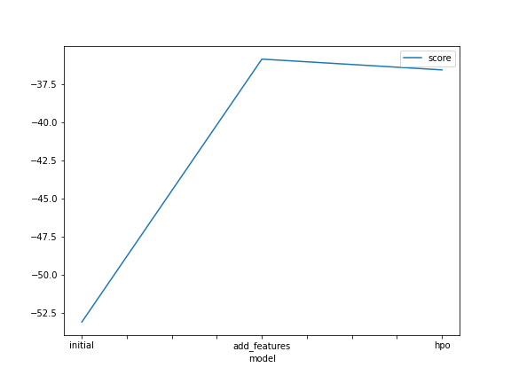
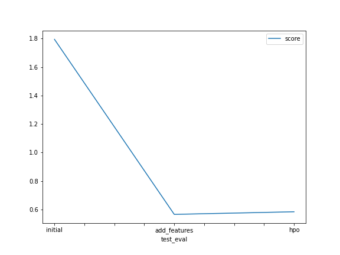

# Report: Predict Bike Sharing Demand with AutoGluon Solution
#### NAME HERE

## Initial Training
### What did you realize when you tried to submit your predictions? What changes were needed to the output of the predictor to submit your results?
Negative predictions were actually not allowed. Due to the fact that we used a regression algorithm, our predictor could sometimes yield negative outputs. All these outputs were set to 0

### What was the top ranked model that performed?
The top ranked model was the Level 3 weighted ensemble. This makes sense as a weighted ensemble combines many different models to increase the accuracy and sensitivity to noise. 

## Exploratory data analysis and feature creation
### What did the exploratory analysis find and how did you add additional features?
My exploratory data analysis showed that there were some categorical variables that were naively being represented as integers. A better representation would be to one hot encode them so that the model could more easily extract patterns from each individual value of the variable. Along with this, the datetime column was also extracted into seperate columns for the year, month, day, and hour, again for similar reasons. 

### How much better did your model preform after adding additional features and why do you think that is?
The model performed much better, with the score decreasing more than threefold. This may have been because seperating out each of the  categories possible values and encoding them makes it easier for the model to find specific patterns between each possible value and the rest of the data. 

## Hyper parameter tuning
### How much better did your model preform after trying different hyper parameters?
The model performed slightly worse, gaining a score of 0.02 on the Kaggle competition. 

### If you were given more time with this dataset, where do you think you would spend more time?
If I had been given more time, I would have experimented with different hyperparameters and tried to find ones that could be better applied to this problem setting. Certain models, such as xgb boost, require extensive hyperparameter tuning to perform well. With my limited resources, I wasn't able to leverage the full potential of hyperparameter tuning to decrease the score. 

### Create a table with the models you ran, the hyperparameters modified, and the kaggle score.
|model|CAT|XGB|GBM|score|
|--|--|--|--|--|
|initial|default|max_depth = 6|min_data_in_leaf = 20|1.79439|
|add_features|default|max_depth = 6|min_data_in_leaf  = 20|0.56504|
|hpo|l2_leaf_reg = 2|max_depth = 8|min_data_in_leaf  = 15|0.58334|

pd.DataFrame({
    "model": ["initial", "add_features", "hpo"],
    "CAT": ["default", "default", 'l2_leaf_reg = 2'],
    "XGB": ["max_depth = 6", "max_depth = 6", 'max_depth = 8'],
    "GBM": ["min_data_in_leaf  = 20", "min_data_in_leaf  = 20", 'min_data_in_leaf  = 15'],
    "score": [1.79439, 0.56504, 0.58334]
})

### Create a line plot showing the top model score for the three (or more) training runs during the project.

### Create a line plot showing the top kaggle score for the three (or more) prediction submissions during the project.

## Summary
This project required the prediction of bike sharing usage based on available data. It was formulated as a regression problem. EDA revealed that certain data types were categorical and that there was a column formatted as a datetime object. These components were extracted and one hot encoded (for the datetime column it was seperated into year, month, day, and hour columns). This data preprocessing greatly helped increase accuracy of the model, decreasing its loss. The model itself was chosen by training multiple models using the Autogluon library. The model with the best score was then chosen to make predictions, yielding a score of 0.56504 when submitted to the Kaggle dataset competition. Hyperparameter tuning on top performing models was attempted, however, due to resource limitations they were unable to yield any model that performed better than the model using the default hyperparameters. Future work could include more analysis of the hyperparameter space to yield more accurate models. 
